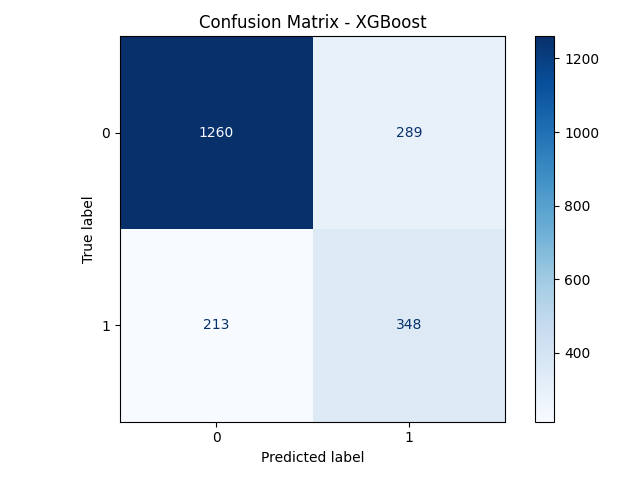
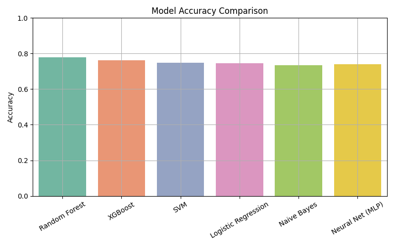
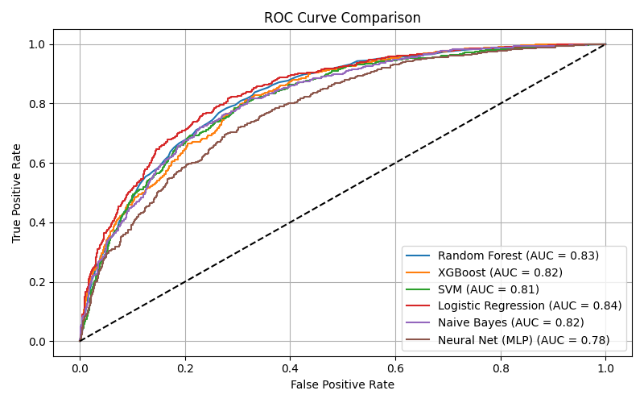

# telcoChurnAnalysis

An end-to-end machine learning project to **predict customer churn** using the Telco dataset, with comprehensive model benchmarking and visualization.

---

## What is This?

This repository demonstrates a complete workflow for telecom churn prediction:
- Multiple machine learning models
- Effective preprocessing & data balancing
- Rich visual outputs (confusion matrices, ROC curves, accuracy charts)
- Business insight for customer retention

---

## Project Structure

```
telcoChurnAnalysis/
├── src/
│   └── main.py
├── data/
│   └── telco.csv
├── outputs/
│   ├── confusion_matrices/
│   │   ├── Random_Forest.png
│   │   ├── XGBoost.png
│   │   └── ...   
│   ├── accuracy_comparison.png
│   └── roc_curves.png
├── results/
│   └── summary.csv
├── requirements.txt
└── README.md
```

---

## Model Workflow

1. **Data Cleaning**: Remove nulls, transform target.
2. **Encoding**: Label encoding for categorical features.
3. **Scaling**: StandardScaler on numeric features.
4. **Balancing**: [SMOTE](https://imbalanced-learn.org/stable/references/generated/imblearn.over_sampling.SMOTE.html) used for imbalanced classes.
5. **Classification** with 6 ML models:
	- Random Forest
	- XGBoost
	- SVM
	- Logistic Regression
	- Naive Bayes
	- Neural Network (MLP)

---

## How to Run

**Setup:**
```bash
pip install -r requirements.txt
```
**Run:**
```bash
python src/main.py
```
All visual outputs will be saved inside the `outputs/` folder.

---

## Business Features

| Feature         | Example value | Description                         |
|-----------------|---------------|-------------------------------------|
| tenure          | 12            | Number of months as a customer      |
| Contract        | "Monthly"     | Subscription type                   |
| MonthlyCharges  | 76.45         | Current monthly bill                |
| ...             | ...           | ...                                 |

---

## Outputs

### Confusion Matrices

Each model’s confusion matrix (classification results):

<div align="center">
  
  
</div>

---

### Model Accuracy Comparison

How well each model performed:

<div align="center">
  
</div>

---

### ROC Curves

All ROC curves overlaid for direct comparison:

<div align="center">
  
</div>

---

## Results (Sample)

An auto-generated summary table is saved at `results/summary.csv`:

| Model              | Accuracy |   AUC    |
|--------------------|----------|----------|
| Random Forest      | 0.78     | 0.83     |
| XGBoost            | 0.76     | 0.82     |
| SVM                | 0.75     | 0.81     |
| Logistic Regression| 0.75     | 0.84     |
| Naive Bayes        | 0.74     | 0.82     |
| Neural Net (MLP)   | 0.74     | 0.78     |

---

## Notes

- **SMOTE** used to balance the data.
- **LabelEncoder** for categorical features.
- **StandardScaler** for normalization.
- Visuals/generated outputs in the `outputs/` folder.
- Dataset not included for copyright/privacy; use your own if needed.

---

## Contributions

Pull requests and suggestions are welcome!  
Feel free to fork or star ⭐ if you found it useful!

---

## Author

Mostafa Mashhadizadeh  
Shiraz University of Technology  
[GitHub: MostafaMashhadi](https://github.com/MostafaMashhadi)

---


